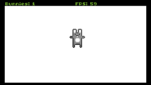

# TIC-80 Bunnymark

Bunnymark in some of the different languages available in [TIC-80](https://tic.compouter).

- [JavaScript](https://tic.computer/play?cart=990)
- [MoonScript](https://tic.computer/play?cart=989)
- [Wren](https://tic.computer/play?cart=988)
- [Squirrel](https://tic.computer/play?cart=987)
- Submit Fennel and Lua ports!



## Usage

```
tic80 dist/bunnymark-js.tic -code src/bunnymark.js -sprites sprites.gif
tic80 dist/bunnymark-moon.tic -code src/bunnymark.moon -sprites sprites.gif
tic80 dist/bunnymark-wren.tic -code src/bunnymark.wren -sprites sprites.gif
tic80 dist/bunnymark-squirrel.tic -code src/bunnymark.nut -sprites sprites.gif
```
